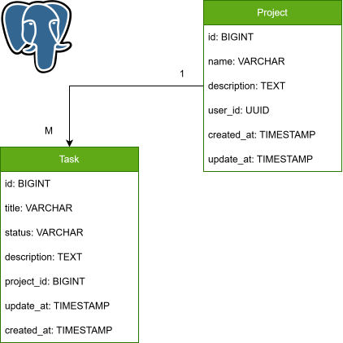

# Документация по TaskManagementSystem::API

В данном файле находится необходимая информация 💎, советы 📎и руководство 📒 по использованию
**<span style="color: blue;">API</span>**-модуля 🎯.

## Модель



## Данные

Для взаимодействия с **<span style="color: blue;">API</span>** 🎯 используются следующие структуры:

* **<span style="color: green;">Project</span>** 💼 - проект;
* **<span style="color: green;">Task</span>** 📝 - задача;
* **<span style="color: green;">Page</span>** 📜 - страница;
* **<span style="color: green;">Filters</span>** 🔎 - фильтры.

### Как работать с проектом?

**<span style="color: green;">Project</span>** 💼:

* **id** (Long): идентификатор проекта;
* **name** (String): название проекта;
* **description** (String): описание проекта (опционально).

Пример:

```json5
{
  id: 1,
  name: "Project1",
  description: "It's my first project. Great!!!"
}
```

### Как работать с задачами?

**<span style="color: green;">Task</span>** 📝:

* **id** (Long): идентификатор задачи;
* **title** (String): заголовок задачи;
* **status** (String): статус задачи;
* **description** (String): описание задачи (опционально).

Пример:

```json5
{
  id: 1,
  title: "Task1",
  status: "begin",
  description: "It's my first task. Great!!!"
}
```

Варианты для status:

* **<span style="color: green;">begin</span>** 🚀 - задача начата;
* **<span style="color: black;">end</span>** 🏁 - задача окончена;
* **<span style="color: purple;">in_progress</span>** 📌 - задача находится в процессе;
* **<span style="color: red;">canceled</span>** ⛔ - задача отменена;
* **<span style="color: yellow;">on_hold</span>** 🔒 - задача приостановлена.

### Как работать со страницей?

**<span style="color: green;">Page</span>** 📜:

* **number** (Integer): текущий номер;
* **size** (Integer): количество элементов на текущей странице;
* **sorts** (List(Sort)): используемые сортировки;
* **totalElements** (Long): количество всех элементов;
* **totalPages** (Integer): количество всех страниц;
* **first** (Boolean): первая ли страница;
* **last** (Boolean): последняя ли страница;
* **empty** (Boolean): пустая ли страница.

**Sort**:

* **property** (String): свойство для сортировки;
* **direction** (String): направление сортировки - ASC или DESC.

Пример:

```json5
{
  number: 5,
  size: 10,
  sorts: [
    {
      property: "name",
      direction: "ASC"
    },
    {
      property: "id",
      direction: "DESC"
    }
  ],
  totalElements: 100,
  totalPages: 10,
  first: false,
  last: false,
  empty: false
}
```

### Как работать с фильтрами?

**<span style="color: green;">Filters</span>** 🔎:

* **filters** (List(Filter)): фильтры.

**Filter**:

* **field** (String): поле для фильтрации;
* **operation** (String): операция фильтрации;
* **value** (Object): первое значение фильтра (опционально);
* **value2** (Object): второе значение фильтра (опционально).

Пример:

```json5
{
  filters: [
    {
      field: "property1",
      operation: "is true"
    },
    {
      field: "property2",
      operation: "between",
      value: 2000,
      value2: 2025
    },
    {
      field: "property3",
      operation: "like",
      value: "pro"
    }
  ]
}
```

Возможные варианты **operation** 💡:

* **equals** - равно;
* **not equals** - не равно;
* **greater** - больше;
* **greater or equals** - больше или равно;
* **less** - меньше;
* **less or equals** - меньше или равно;
* **like** - содержит;
* **not like** - не содержит;
* **starts with** - начинается с;
* **not starts with** - не начинается с;
* **ends with** - заканчивается;
* **not ends with** - не заканчивается;
* **is null** - не определено;
* **is not null** - определено;
* **is empty** - пусто;
* **is not empty** - не пусто;
* **is true** - истина;
* **is false** - ложь;
* **in** - в списке;
* **not in** - не в списке;
* **between** - между;
* **not between** - не между;
* **before** - до;
* **after** - после.

## REST

Для взаимодействия с **<span style="color: blue;">API</span>** 🎯 можно использовать следующие медиа-типы:

* **<span style="color: green;">application/json</span>**;
* **<span style="color: purple;">application/xml</span>**;
* **<span style="color: red;">application/yaml</span>**.

### API для проектов

```http request
GET api/projects
```

* <span style="color: yellow;">Операция</span> 🚀: возвращает список проектов пользователя, а также информацию о
  странице.
* <span style="color: purple;">Ожидаемые параметры</span> 📊: **page** (0) - номер страницы, **size** (10) - размер
  страницы, **sort** (name) - сортировка.
* <span style="color: purple;">Ожидаемое тело запроса</span> 🧰: не ожидается.
* <span style="color: purple;">Ожидаемые заголовки запроса</span> 📰: **Bearer**-токен.
* <span style="color: orange;">Предсказуемые ошибки</span> ⛔: **<span style="color: orange;">401</span> UNAUTHORIZED**.
* <span style="color: green;">Результат</span> ✅: **<span style="color: green;">200</span> OK**.

```http request
GET api/projects/{id}
```

* <span style="color: yellow;">Операция</span> 🚀: возвращает проект пользователя по идентификатору.
* <span style="color: purple;">Ожидаемые параметры</span> 📊: не ожидается.
* <span style="color: purple;">Ожидаемое тело запроса</span> 🧰: не ожидается.
* <span style="color: purple;">Ожидаемые заголовки запроса</span> 📰: **Bearer**-токен.
* <span style="color: orange;">Предсказуемые ошибки</span> ⛔: **<span style="color: orange;">401</span> UNAUTHORIZED**,
  **<span style="color: orange;">403</span> FORBIDDEN**, **<span style="color: orange;">404</span> NOT FOUND**.
* <span style="color: green;">Результат</span> ✅: **<span style="color: green;">200</span> OK**.

```http request
GET api/projects/{id}/tasks
```

* <span style="color: yellow;">Операция</span> 🚀: возвращает список задач проекта по идентификатору, а также
  информацию о странице.
* <span style="color: purple;">Ожидаемые параметры</span> 📊: **page** (0) - номер страницы, **size** (10) - размер
  страницы, **sort** (title) - сортировка.
* <span style="color: purple;">Ожидаемое тело запроса</span> 🧰: не ожидается.
* <span style="color: purple;">Ожидаемые заголовки запроса</span> 📰: **Bearer**-токен.
* <span style="color: orange;">Предсказуемые ошибки</span> ⛔: **<span style="color: orange;">401</span> UNAUTHORIZED**,
  **<span style="color: orange;">403</span> FORBIDDEN**, **<span style="color: orange;">404</span> NOT FOUND**.
* <span style="color: green;">Результат</span> ✅: **<span style="color: green;">200</span> OK**.

```http request
POST api/projects/search
```

* <span style="color: yellow;">Операция</span> 🚀: возвращает список проектов пользователя по фильтру, а также информацию
  о странице.
* <span style="color: purple;">Ожидаемые параметры</span> 📊: **page** (0) - номер страницы, **size** (10) - размер
  страницы, **sort** (name) - сортировка.
* <span style="color: purple;">Ожидаемое тело запроса</span> 🧰: фильтр.
* <span style="color: purple;">Ожидаемые заголовки запроса</span> 📰: **Bearer**-токен.
* <span style="color: orange;">Предсказуемые ошибки</span> ⛔: **<span style="color: orange;">400</span> BAD REQUEST**,
  **<span style="color: orange;">401</span> UNAUTHORIZED**.
* <span style="color: green;">Результат</span> ✅: **<span style="color: green;">200</span> OK**.

```http request
POST api/projects
```

* <span style="color: yellow;">Операция</span> 🚀: создаёт новый проект и возвращает его; также возвращает ссылку на
  него.
* <span style="color: purple;">Ожидаемые параметры</span> 📊: не ожидается.
* <span style="color: purple;">Ожидаемое тело запроса</span> 🧰: проект.
* <span style="color: purple;">Ожидаемые заголовки запроса</span> 📰: **Bearer**-токен.
* <span style="color: orange;">Предсказуемые ошибки</span> ⛔: **<span style="color: orange;">400</span> BAD REQUEST**,
  **<span style="color: orange;">401</span> UNAUTHORIZED**, **<span style="color: orange;">409</span> CONFLICT**.
* <span style="color: green;">Результат</span> ✅: **<span style="color: green;">201</span> CREATED**.

```http request
POST api/projects/{id}/tasks
```

* <span style="color: yellow;">Операция</span> 🚀: создаёт новую задачу в проекте и возвращает её; также возвращает
  ссылку на неё.
* <span style="color: purple;">Ожидаемые параметры</span> 📊: не ожидается.
* <span style="color: purple;">Ожидаемое тело запроса</span> 🧰: задача.
* <span style="color: purple;">Ожидаемые заголовки запроса</span> 📰: **Bearer**-токен.
* <span style="color: orange;">Предсказуемые ошибки</span> ⛔: **<span style="color: orange;">400</span> BAD REQUEST**,
  **<span style="color: orange;">401</span> UNAUTHORIZED**, **<span style="color: orange;">403</span> FORBIDDEN**,
  **<span style="color: orange;">404</span> NOT FOUND**, **<span style="color: orange;">409</span> CONFLICT**.
* <span style="color: green;">Результат</span> ✅: **<span style="color: green;">201</span> CREATED**.

```http request
PUT api/projects/{id}
```

* <span style="color: yellow;">Операция</span> 🚀: полностью заменяет проект по идентификатору и возвращает его.
* <span style="color: purple;">Ожидаемые параметры</span> 📊: не ожидается.
* <span style="color: purple;">Ожидаемое тело запроса</span> 🧰: проект.
* <span style="color: purple;">Ожидаемые заголовки запроса</span> 📰: **Bearer**-токен.
* <span style="color: orange;">Предсказуемые ошибки</span> ⛔: **<span style="color: orange;">400</span> BAD REQUEST**,
  **<span style="color: orange;">401</span> UNAUTHORIZED**, **<span style="color: orange;">403</span> FORBIDDEN**,
  **<span style="color: orange;">404</span> NOT FOUND**, **<span style="color: orange;">409</span> CONFLICT**.
* <span style="color: green;">Результат</span> ✅: **<span style="color: green;">200</span> OK**.

```http request
PATCH api/projects/{id}
```

* <span style="color: yellow;">Операция</span> 🚀: частично обновляет проект по идентификатору и возвращает его.
* <span style="color: purple;">Ожидаемые параметры</span> 📊: не ожидается.
* <span style="color: purple;">Ожидаемое тело запроса</span> 🧰: проект.
* <span style="color: purple;">Ожидаемые заголовки запроса</span> 📰: **Bearer**-токен.
* <span style="color: orange;">Предсказуемые ошибки</span> ⛔: **<span style="color: orange;">400</span> BAD REQUEST**,
  **<span style="color: orange;">401</span> UNAUTHORIZED**, **<span style="color: orange;">403</span> FORBIDDEN**,
  **<span style="color: orange;">404</span> NOT FOUND**, **<span style="color: orange;">409</span> CONFLICT**.
* <span style="color: green;">Результат</span> ✅: **<span style="color: green;">200</span> OK**.

```http request
DELETE api/projects
```

* <span style="color: yellow;">Операция</span> 🚀: удаляет все проекты и все задачи пользователя.
* <span style="color: purple;">Ожидаемые параметры</span> 📊: не ожидается.
* <span style="color: purple;">Ожидаемое тело запроса</span> 🧰: не ожидается.
* <span style="color: purple;">Ожидаемые заголовки запроса</span> 📰: **Bearer**-токен.
* <span style="color: orange;">Предсказуемые ошибки</span> ⛔: **<span style="color: orange;">401</span> UNAUTHORIZED**.
* <span style="color: green;">Результат</span> ✅: **<span style="color: green;">204</span> NO CONTENT**.

```http request
DELETE api/projects/{id}
```

* <span style="color: yellow;">Операция</span> 🚀: удаляет проект и все его задачи по идентификатору.
* <span style="color: purple;">Ожидаемые параметры</span> 📊: не ожидается.
* <span style="color: purple;">Ожидаемое тело запроса</span> 🧰: не ожидается.
* <span style="color: purple;">Ожидаемые заголовки запроса</span> 📰: **Bearer**-токен.
* <span style="color: orange;">Предсказуемые ошибки</span> ⛔: **<span style="color: orange;">401</span> UNAUTHORIZED**,
  **<span style="color: orange;">403</span> FORBIDDEN**, **<span style="color: orange;">404</span> NOT FOUND**.
* <span style="color: green;">Результат</span> ✅: **<span style="color: green;">204</span> NO CONTENT**.

```http request
DELETE api/projects/{id}/tasks
```

* <span style="color: yellow;">Операция</span> 🚀:  удаляет все задачи проекта по идентификатору.
* <span style="color: purple;">Ожидаемые параметры</span> 📊: не ожидается.
* <span style="color: purple;">Ожидаемое тело запроса</span> 🧰: не ожидается.
* <span style="color: purple;">Ожидаемые заголовки запроса</span> 📰: **Bearer**-токен.
* <span style="color: orange;">Предсказуемые ошибки</span> ⛔: **<span style="color: orange;">401</span> UNAUTHORIZED**,
  **<span style="color: orange;">403</span> FORBIDDEN**, **<span style="color: orange;">404</span> NOT FOUND**.
* <span style="color: green;">Результат</span> ✅: **<span style="color: green;">204</span> NO CONTENT**.

### API для задач

```http request
GET api/tasks/{id}
```

* <span style="color: yellow;">Операция</span> 🚀: возвращает задачу пользователя по идентификатору.
* <span style="color: purple;">Ожидаемые параметры</span> 📊: не ожидается.
* <span style="color: purple;">Ожидаемое тело запроса</span> 🧰: не ожидается.
* <span style="color: purple;">Ожидаемые заголовки запроса</span> 📰: **Bearer**-токен.
* <span style="color: orange;">Предсказуемые ошибки</span> ⛔: **<span style="color: orange;">401</span> UNAUTHORIZED**,
  **<span style="color: orange;">403</span> FORBIDDEN**, **<span style="color: orange;">404</span> NOT FOUND**.
* <span style="color: green;">Результат</span> ✅: **<span style="color: green;">200</span> OK**.

```http request
POST api/tasks/search
```

* <span style="color: yellow;">Операция</span> 🚀: возвращает список задач пользователя по фильтру, а также информацию
  о странице
* <span style="color: purple;">Ожидаемые параметры</span> 📊: **page** (0) - номер страницы, **size** (10) - размер
  страницы, **sort** (title) - сортировка.
* <span style="color: purple;">Ожидаемое тело запроса</span> 🧰: фильтр.
* <span style="color: purple;">Ожидаемые заголовки запроса</span> 📰: **Bearer**-токен.
* <span style="color: orange;">Предсказуемые ошибки</span> ⛔: **<span style="color: orange;">400</span> BAD REQUEST**,
  **<span style="color: orange;">401</span> UNAUTHORIZED**.
* <span style="color: green;">Результат</span> ✅: **<span style="color: green;">200</span> OK**.

```http request
PUT api/tasks/{id}
```

* <span style="color: yellow;">Операция</span> 🚀: полностью заменяет задачу по идентификатору и возвращает её.
* <span style="color: purple;">Ожидаемые параметры</span> 📊: не ожидается.
* <span style="color: purple;">Ожидаемое тело запроса</span> 🧰: задача.
* <span style="color: purple;">Ожидаемые заголовки запроса</span> 📰: **Bearer**-токен.
* <span style="color: orange;">Предсказуемые ошибки</span> ⛔: **<span style="color: orange;">400</span> BAD REQUEST**,
  **<span style="color: orange;">401</span> UNAUTHORIZED**, **<span style="color: orange;">403</span> FORBIDDEN**,
  **<span style="color: orange;">404</span> NOT FOUND**, **<span style="color: orange;">409</span> CONFLICT**.
* <span style="color: green;">Результат</span> ✅: **<span style="color: green;">200</span> OK**.

```http request
PATCH api/tasks/{id}
```

* <span style="color: yellow;">Операция</span> 🚀: частично обновляет задачу по идентификатору и возвращает её.
* <span style="color: purple;">Ожидаемые параметры</span> 📊: не ожидается.
* <span style="color: purple;">Ожидаемое тело запроса</span> 🧰: задача.
* <span style="color: purple;">Ожидаемые заголовки запроса</span> 📰: **Bearer**-токен.
* <span style="color: orange;">Предсказуемые ошибки</span> ⛔: **<span style="color: orange;">400</span> BAD REQUEST**,
  **<span style="color: orange;">401</span> UNAUTHORIZED**, **<span style="color: orange;">403</span> FORBIDDEN**,
  **<span style="color: orange;">404</span> NOT FOUND**, **<span style="color: orange;">409</span> CONFLICT**.
* <span style="color: green;">Результат</span> ✅: **<span style="color: green;">200</span> OK**.

```http request
PATCH api/tasks/{task_id}/project/{project_id}
```

* <span style="color: yellow;">Операция</span> 🚀: переносит задачу на другой проект и возвращает её.
* <span style="color: purple;">Ожидаемые параметры</span> 📊: не ожидается.
* <span style="color: purple;">Ожидаемое тело запроса</span> 🧰: не ожидается.
* <span style="color: purple;">Ожидаемые заголовки запроса</span> 📰: **Bearer**-токен.
* <span style="color: orange;">Предсказуемые ошибки</span> ⛔: **<span style="color: orange;">401</span> UNAUTHORIZED**,
  **<span style="color: orange;">403</span> FORBIDDEN**, **<span style="color: orange;">404</span> NOT FOUND**,
  **<span style="color: orange;">409</span> CONFLICT**.
* <span style="color: green;">Результат</span> ✅: **<span style="color: green;">200</span> OK**.

```http request
DELETE api/tasks/{id}
```

* <span style="color: yellow;">Операция</span> 🚀: удаляет задачу по идентификатору.
* <span style="color: purple;">Ожидаемые параметры</span> 📊: не ожидается.
* <span style="color: purple;">Ожидаемое тело запроса</span> 🧰: не ожидается.
* <span style="color: purple;">Ожидаемые заголовки запроса</span> 📰: **Bearer**-токен.
* <span style="color: orange;">Предсказуемые ошибки</span> ⛔: **<span style="color: orange;">401</span> UNAUTHORIZED**,
  **<span style="color: orange;">403</span> FORBIDDEN**, **<span style="color: orange;">404</span> NOT FOUND**.
* <span style="color: green;">Результат</span> ✅: **<span style="color: green;">204</span> NO CONTENT**.

## Запуск

### Стандартный запуск

Для запуска 🚀 необходимо выполнить следующие действия:

```shell

# Клонируем репозиторий
git clone https://github.com/a-slelin/TaskManagement.git;

# Переходим в папку корневой библиотеки Core;
cd TaskManagement/Core;

# Устанавливаем корневую библиотеку в локальный репозиторий maven (.m2);
mvn clean install;

# Переходим в папку API;
cd ../API;

# Собираем проект в jar-файл, минуя тесты;
mvn clean package -DskipTests;

# Запускаем приложение. Управление переменными окружения;
# происходит в файле .env для удобства.
export $(grep -v '^#' .env | xargs) && java -jar target/API.jar;

# Либо передаём в ручную все переменные окружения;
java -jar target/API.jar \
    --DB_HOST=<хост СУБД> \
    --DB_PORT=<порт СУБД> \
    --DB_NAME=<название БД> \
    --DB_USER_NAME=<пользователь в БД> \
    --DB_USER_PASSWORD=<пароль пользователя в БД> \
    --APP_PORT=<порт приложения> \
    --LOG_PATH=<папка для логов приложения> \
    --JWT_SECRET=<секрет для приложения>;

```

Остановить программу ⛔ можно обычным "Ctrl+C".

### Быстрый запуск с помощью DockerCompose

Для быстрого запуска 🚀 можно использовать 🐳 DockerCompose файл, для этого необходимо, чтобы был установлен docker на
вашу машину. Также убедитесь, что база данных запущена и готова к работе. Следуйте инструкциям (необходимыми настройками
🔧 можно управлять в .env файле):

```shell

# Клонируем репозиторий;
git clone https://github.com/TaskManagement.git;

# Переходим в папку API;
cd TaskManagement/API;

# Запускаем приложение;
docker compose up;
```

Для остановки ⛔ программы можно сделать следующее (или "Ctrl+C"):

```shell

docker compose down;

```

## Улучшения

Для **<span style="color: blue;">API</span>**-модуля 🎯 планируются некоторые улучшения:

**1)** В модель данных добавить аудит, который будет показывать кто создал сущность и кто последний обновлял эту
сущность. Под слово "кто" можно понимать UUID-идентификатор пользователя. Данное улучшение может быть необходимо для
работы администраторов.

**2)** Описать документацию с помощью Javadoc. Однозначно будет полезно для развивающихся проектов, особенно, если
разработка начнётся в команде.

**3)** Добавить кэш в виде Redis, для улучшения производительности.

## Релизы

На данный момент версия **<span style="color: blue;">API</span>** 🎯 - **1.0** 🔖.

## Статус

Находится на этапе разработки 💻.

## Разработчики

Слелин Александр 🤗 (**a-slelin**).
