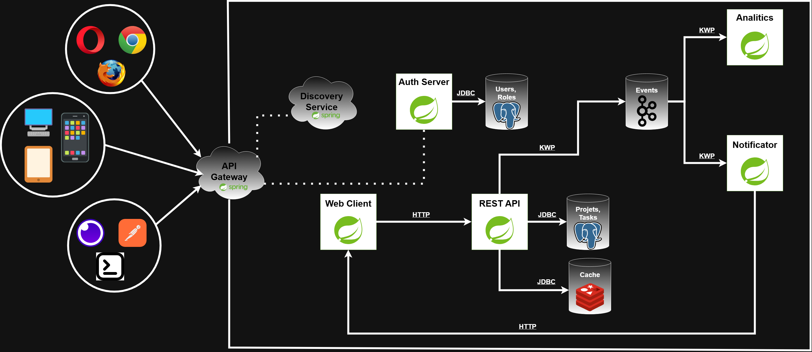

# Система управления задачами и уведомлений

## Цели

Цель репозитория показать развитие некоторого проекта от самых "низов" (не используем Spring и частично Jakarta EE) до
самых "верхов" (полностью написан на Spring Boot Framework и использует микросервисную архитектуру).

Проект последовательно развивается от использования низкоуровневых технологий вроде сервлетов и драйверов JDBC, до
высокоуровневых технологий, которые используются в частности в Spring Boot Framework.

## Описание

Проект версии - **v6.0**.

Этапы (добавления к версии 5.0):

Модель (без исправлений):


Перевел проект на Spring Framework Boot. Загрузил докер образ проекта на DockerHub.

Улучшения:

1) Добавил логирование (Spring Boot Aop).
2) Добавил тестовое покрытие (Spring Boot Test).
3) Добавил миграцию базы данных (LiquiBase).
4) Добавил поиск сущностей по фильтрам.
5) Улучшил url-пути (Параметры).
6) Добавил обработку xml и yaml помимо json (Jackson DataFormat).
7) Добавил пагинацию для путей, где возвращается список (Spring Boot Data Jpa).
8) Добавил автоконфигурацию, которая автоматически поднимает Tomcat (Spring Boot WebMvc).
9) Добавил докер образ приложения в DockerHub.

Проблемы (для будущей доработки):

1) Есть REST API, а потребителя нет. Необходимо написать WebClient, который будет общаться с этим REST API.
2) REST API должен кешироваться (Redis) для увеличения производительности.
3) Необходимо защитить данные, причём не только REST API, но и другие возможные сервисы нашего приложения; для этого
   нужно разработать auth-сервис.
4) Модель не совсем подходит под описание проекта: необходимо продумать варианты, где пользователи могут приглашать
   других пользователей в свои проекты (с разными ролями - чтение, изменение) и т.п.
5) Создать сервис, который будет уведомлять пользователей о событиях (приглашения, изменения статуса задачи и т.д.).
   Сам REST API не блокируется на этой отправке, а отправляет событие в Apache Kafka, где данные ждет сервис
   нотификации.
6) Приложение должно быть "мобильным", поэтому ему понадобится Discovery-сервис, который поможет узнать
   где кто запущен и на каком порту.
7) Возможно есть reason добавить API Gateway для приложения.

На данный момент проект стремится к реализации микросервисной архитектуры, верхнеуровневая схема которого, выглядит так:



Ожидаемые обновления:

В версии **v6.1** ожидается добавление сервиса, отвечающего за авторизацию и безопасность в целом.

## Требования

* Для запуска необходимо предустановленная СУБД Postgres (я использую версию **18.3**), либо она же запущенная с помощью
  docker.
* Apache Maven - с помощью него будет собран проект (использую версию **3.9.9**).

## Запуск

Для того чтобы запустить приложение, необходимо:

1) Запустить Postgres СУБД нативно или же через докер-контейнер (docker/db/docker-compose.yaml):

   ````shell
   cd docker;
   docker compose up;
   ````

2) Подключиться к СУБД и выполнить sql-скрипт [`init.sql`](src/main/resources/db/init.sql) по созданию базы данных и
   пользователя для подключения к ней.

3) Клонируем проект репозитория и собираем его. После чего запускаем приложение:
   ```shell
   git clone https://github.com/a-slelin/TaskManagement.git;
   cd TaskManagement;
   mvn clean package;
   # Если нужно, то укажите параметры подключения к базе данных;
   java -jar target/TaskManagementSystem.jar;
   ```

Приложение запущено!

## Быстрый запуск

Вы также можете запустить приложение через докер, который должен быть у вас установлен; я использую версию **29.2.1**.
В папке docker находятся docker-compose.yaml файлы с помощью которых можно запустить приложение не клонируя проект и не
собирая его. Удачи!

## Замечания

Для деплоя приложения используется файл bat/deploy.bat, который тестирует, собирает и пушит на DockerHub. На самом деле
так и выглядит самый "простетский" CI/CD. Для того чтобы он работал автоматически можно было бы развернуть локально
Jenkins (можно docker-контейнер) установить плагины и необходимые credentials для подключения к проекту GitHub и указать
на понятном ему скриптовом языке примерно то же самое. Так как проект маленький и простой и не требует больших усилий
или синхронизации, то я этого использовать не буду, но вообще так нужно делать в нормальных проектах.

## Версии

* Версия проекта **v1.0** - простое низкоуровневое веб-приложение.
* Версия проекта **v2.0** - добавлено JPA (Hibernate), а также Validation API (Hibernate Validator).
* Версия проекта **v3.0** - добавлен JAX-RS (Jersey).
* Версия проекта **v4.0** - добавлена полная совместимость с Jakarta EE (деплой на WildFly).
* Версия проекта **v5.0** - переход с Jakarta EE на Spring Framework.
* Текущая версия проекта **v6.0** - переход на Spring Boot Framework.

## Статус

* Находится в разработке!

## Разработчики

* Слелин А. В. (**a-slelin**)
