# Система управления задачами и уведомлений

## Цели

Цель репозитория показать развитие некоторого проекта от самых "низов" (не используем Spring и частично JakartaEE) до
самых "верхов" (полностью написан на Spring Boot и использует микросервисную архитектуру).

## Описание

Проект версии - **v3.0**.

Этапы (добавления к версии 2.0):

1) Оставил ту же самую модель.
   
2) Добавлены RESTful-контроллеры JAX-RS (Jersey).
3) Добавил ещё некоторые пути в контроллеры.
4) Добавил глобальную обработку исключений.

Улучшения:

1) Код (контроллеров) стал гораздо легче читать, что-то добавить уже не так тяжело.
2) Обработка исключений позволяет быстро выявить проблему.
3) Добавлен какой-никакой декларативный подход и даже элементы IoC, где мы просим внедрить информацию о пути или
   сканировать пакеты.

Проблемы (для будущей доработки):

1) Очень неудобно постоянно открывать и закрывать транзакции (em.getTransaction().begin()), вот бы кто-нибудь их сам
   обрабатывал, а мы декларативно указывали где она должна быть.
2) Транзакции должны быть в сервисах, а в репозиториях код обращения к базе данных.
3) Опять синглтоны... Вот бы кто-то создал контекст и вставлял нам нужные объекты (IoC).

Ожидаемые обновления:

В версии **v4.0** ожидается переход на полное использование JakartaEE и деплой на сервер приложений WildFly.

## Требования

* Для запуска необходимо предустановленная СУБД Postgres (я использую версию **18.3**), либо она же запущенная с помощью
  docker.
* Также необходимо скачать WildFly сервер приложений (я использую версию **39.0.1.Final**).
* Apache Maven - с помощью него будет собран проект (использую версию **3.9.9**).

## Запуск

Для того чтобы запустить приложение, необходимо:

## Запуск СУБД PostgreSQL

1) Запустить Postgres СУБД нативно или же через докер-контейнер (docker/docker-compose.yaml):

   ````shell
   cd docker;
   docker compose up;
   ````

2) Подключиться к СУБД и выполнить sql-скрипт [`init.sql`](src/main/resources/db/init.sql) по созданию базы данных и
   пользователя для подключения к ней.

3) Далее необходимо выполнить последовательно два скрипта: [`schema.sql`](src/main/resources/db/schema.sql) - для
   создания схемы в базе данных и [`data.sql`](src/main/resources/db/data.sql) - для создания тестовых данных.

## Запуск WildFly

1) Для всех производимых нами действий понадобится создать супер-пользователя. Для этого не обходимо:
   ```shell
   cd <путь к wildfly>/bin;
   .\add-user.bat;
   ```
   Далее вводим данные пользователя, вот как это примерно будет выглядеть (ввожу пароль root):
   ```shell
   What type of user do you wish to add?
   
   a) Management User (mgmt-users.properties)
   b) Application User (application-users.properties)
   (a): a
   
   Enter the details of the new user to add.
   Using realm 'ManagementRealm' as discovered from the existing property files.
   Username : root
   The username 'root' is easy to guess
   Are you sure you want to add user 'root' yes/no? y
   Password recommendations are listed below. To modify these restrictions edit the add-user.properties configuration file.
   
   - The password should be different from the username
   - The password should not be one of the following restricted values {root, admin, administrator}
   - The password should contain at least 8 characters, 1 alphabetic character(s), 1 digit(s), 1 non-alphanumeric symbol(s)
     Password :
   
   WFLYDM0098: The password should be different from the username
   Are you sure you want to use the password entered yes/no? y
   Re-enter Password :
   
   What groups do you want this user to belong to? (Please enter a comma separated list, or leave blank for none)[  ]:
   admin,manager
   About to add user 'root' for realm 'ManagementRealm'
   Is this correct yes/no? y
   Added user 'root' to file 'D:\wildfly-39.0.1.Final\standalone\configuration\mgmt-users.properties'
   Added user 'root' to file 'D:\wildfly-39.0.1.Final\domain\configuration\mgmt-users.properties'
   Added user 'root' with groups admin,manager to file 'D:
   \wildfly-39.0.1.Final\standalone\configuration\mgmt-groups.properties'
   Added user 'root' with groups admin,manager to file 'D:
   \wildfly-39.0.1.Final\domain\configuration\mgmt-groups.properties'
   Press any key to continue . . .
   ```

2) Для запуска необходимо выполнить следующее:
      ```shell
   cd <путь к wildfly>/bin;
   .\standalone.bat;
   ```
3) Теперь сервер WildFly запущен и доступен по адресу **http://localhost:9990**.
4) При переходе по ссылке будет необходимо сначала "залогиниться" под только что созданным пользователем.
   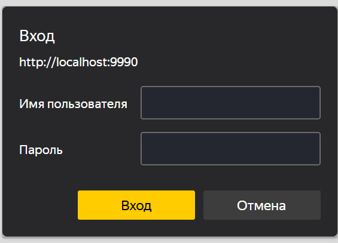
5) После чего перед нами откроется основная панель:
   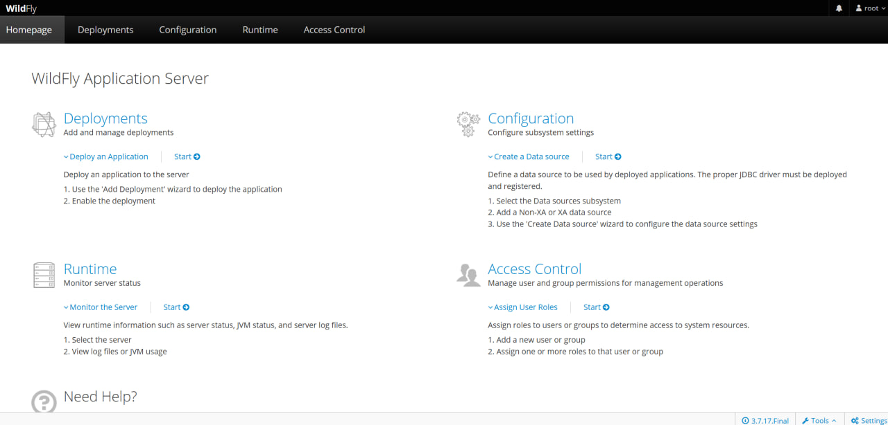

## Создание DataSource в WildFly

1) Сначала необходимо скачать Postgre драйвер и установить его как модуль, чтоб его смог увидеть WildFly. Если вам очень
   лень скачивать что-то, то может при клонировании залезть в папочку **util/** и оттуда взять последнюю, на сегодняшний
   момент, версию. Далее нужно установить этот драйвер по пути: **<путь к wildfly>\modules\org\postgresql\main**. После
   чего также необходимо добавить xml конфиг (module.xml):
   ```xml
   <?xml version="1.0" encoding="UTF-8"?>
   <module xmlns="urn:jboss:module:1.9" name="org.postgresql">
       <resources>
              <resource-root path="postgresql-42.7.10.jar"/>
       </resources>
       <dependencies>
           <module name="javax.api"/>
           <module name="javax.transaction.api"/>
       </dependencies>
   </module>
   ```

2) Переходи в секцию конфигураций на главной панели:
   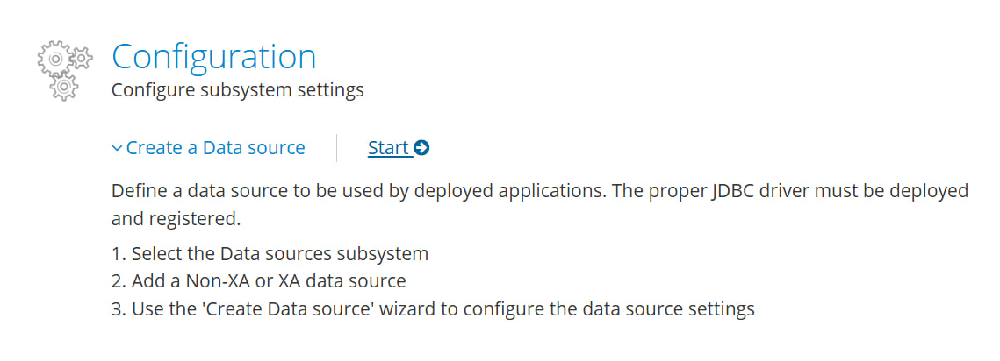
3) Далее переходим по пути к необходимому ресурсу:
   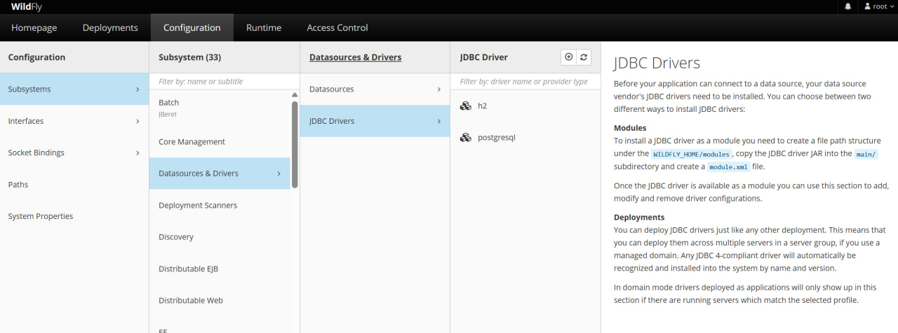
4) Создаем новый Postgre драйвер (у меня уже создан):
   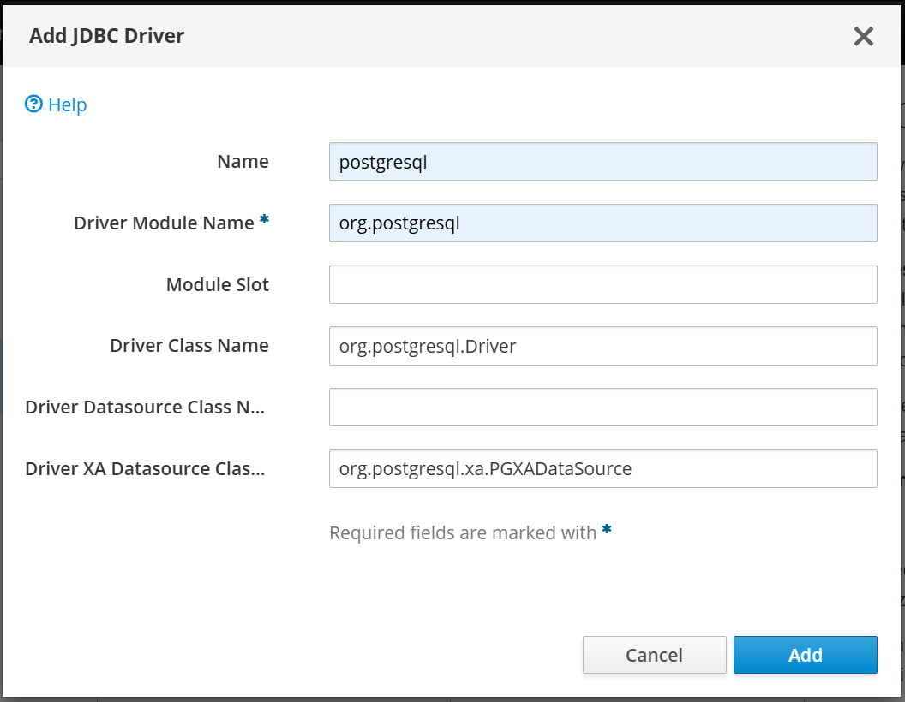

Отлично! Драйвер есть, теперь осталось создать сам DataSource, это можно сделать в том же пути, следуя инструкциям ниже:

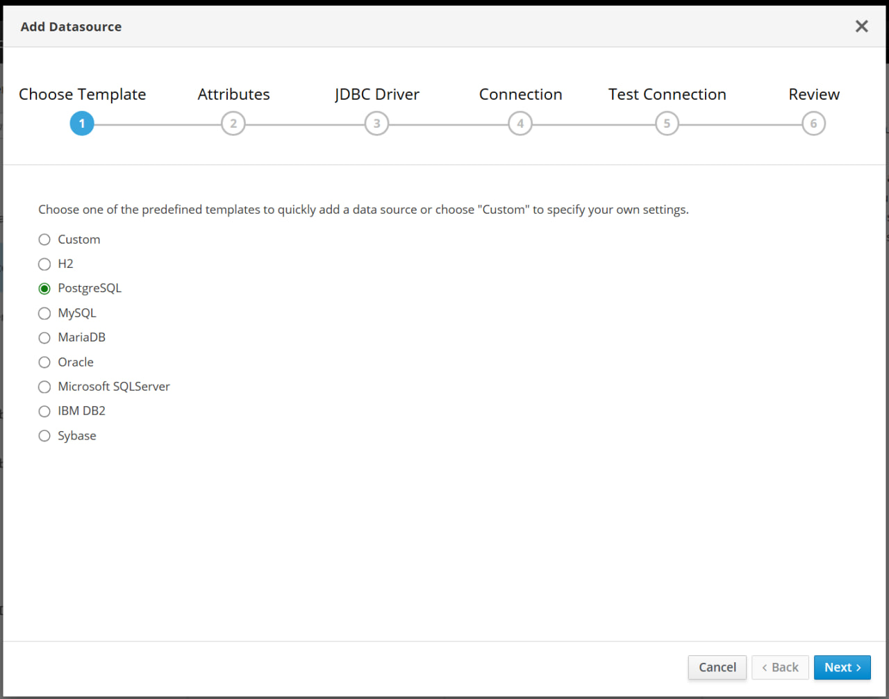

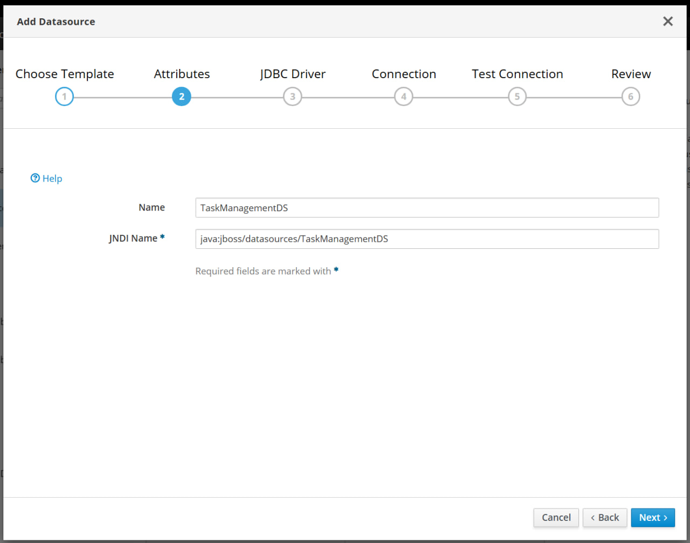

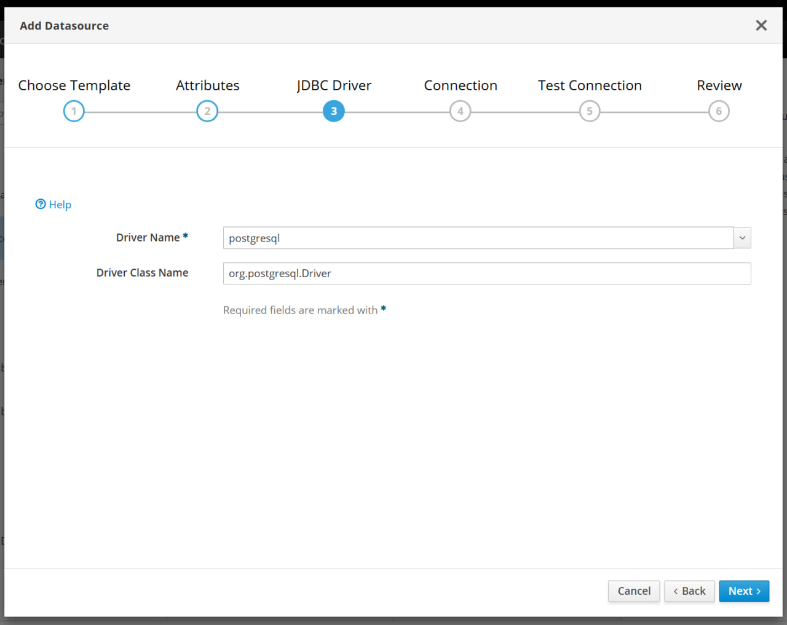

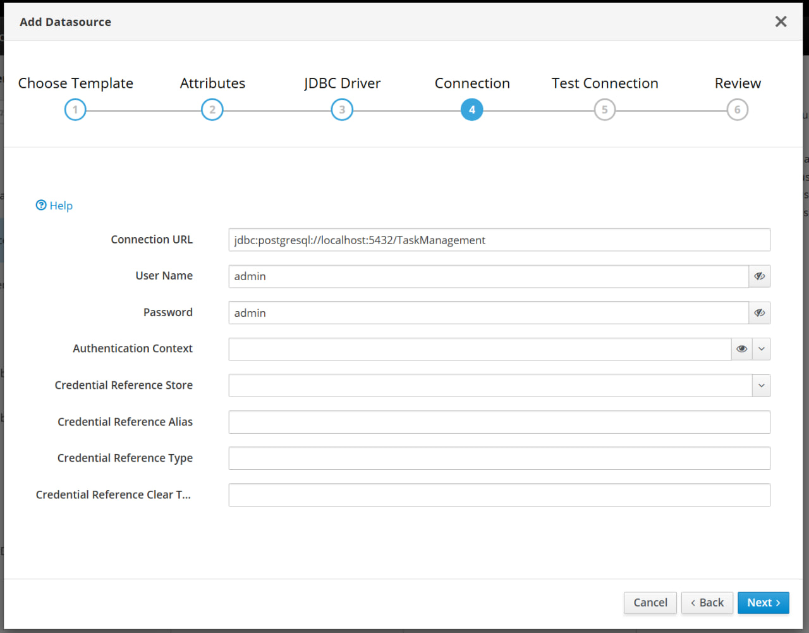

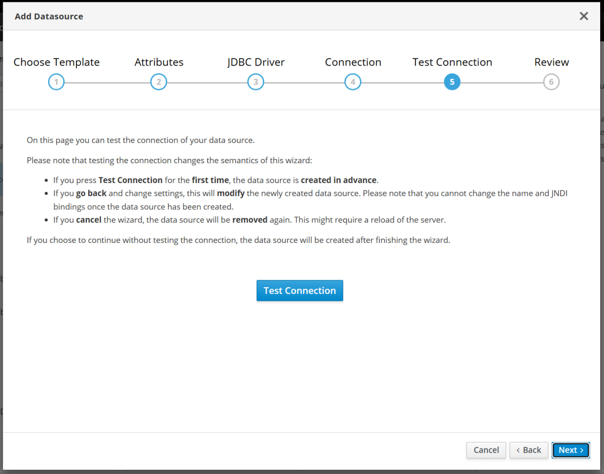

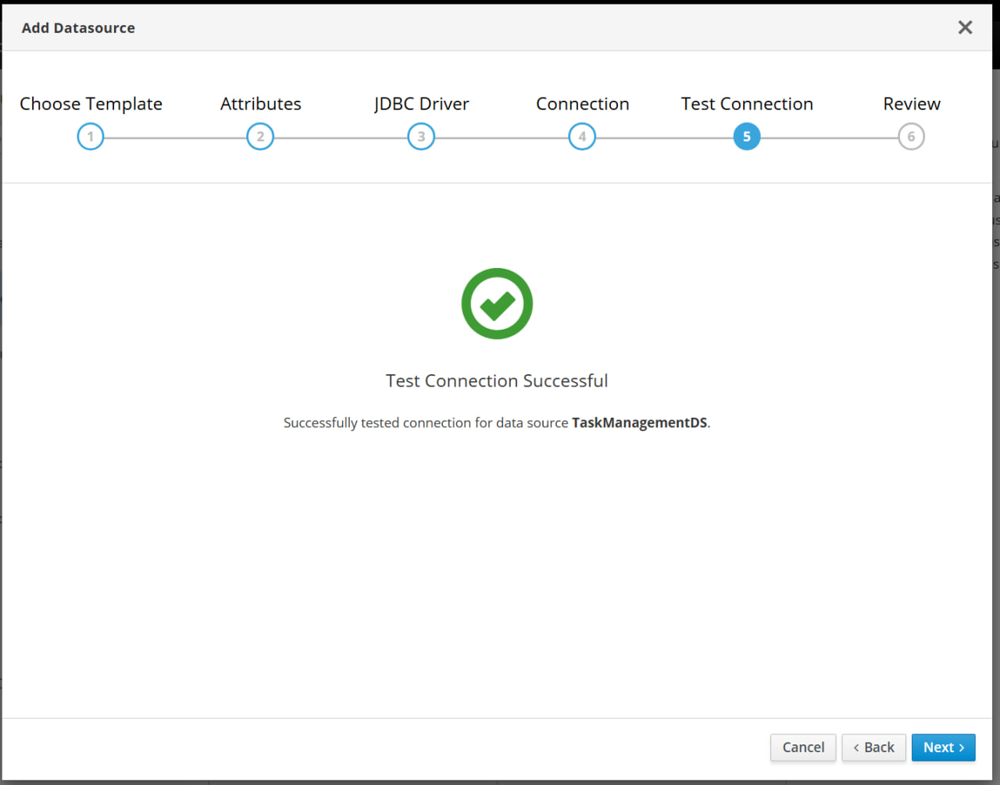

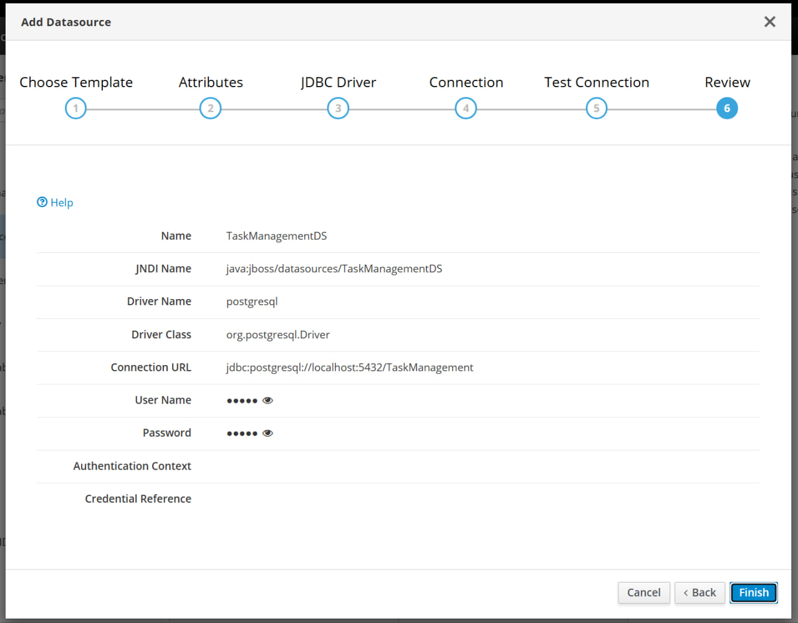

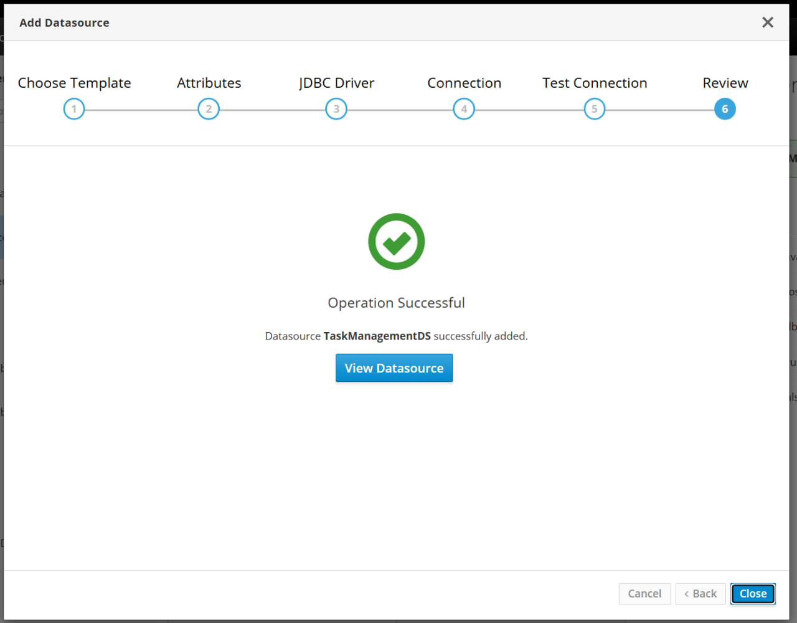

Теперь datasource создан!

## Версии

* Версия проекта **v1.0** - простое низкоуровневое веб-приложение.
* Версия проекта **v2.0** - добавлено JPA (Hibernate), а также Validation API (Hibernate Validator).
* Текущая версия проекта **v3.0** - добавлен JAX-RS (Jersey).

## Статус

* Находится в разработке!

## Разработчики

* Слелин А. В. (**a-slelin**)
