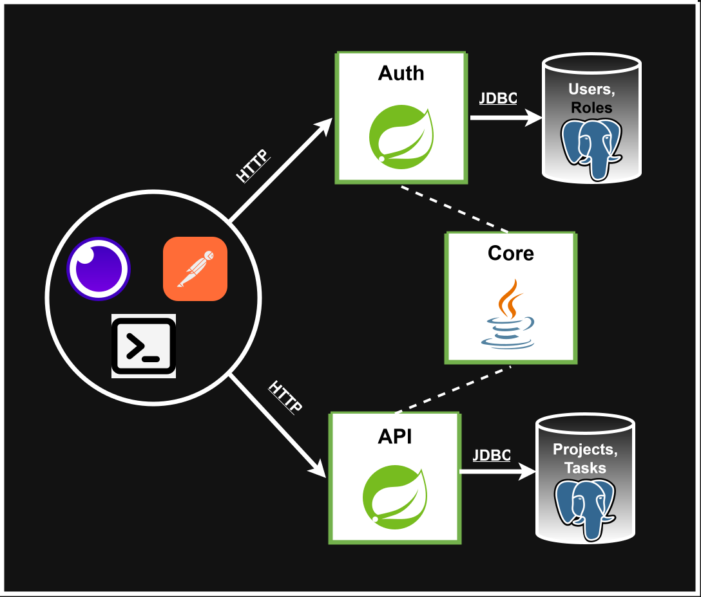
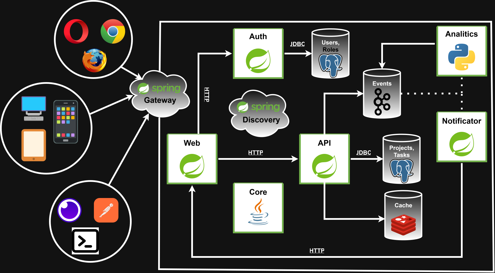

# Система управления задачами 📑 и уведомлениями 📨

## Цели 🎯

Целью репозитория 💎 **TaskManagement** 💎 является построение качественного приложения
🤳, которое помогает пользователям совместно работать над задачами и управлять своим графиком 📅. Система использует
современные технологии 🔧, чтобы достичь заявленных целей. Репозиторий является полностью открытым и может
использоваться в любых целях 💯.

Второстепенной целью проекта является развитие 📈 приложения от использования низкоуровневых технологий 🤔 вроде
сервлетов, до высокоуровневых технологий ✅, которые активно используются в наше время (Spring 🍃).

## Описание 📎

Условные пользователи 🧒 (консоль, HTTP-клиенты и т.д.) взаимодействую с
**Auth**-микросервисом; в нём они могут регистрироваться, логиниться 🔐 и выходить
из системы. Также есть возможность управлять своими данными (телефон 📱, электронная почта 📧 и т.д.). После получения
токенов от **Auth**-микросервиса можно обращаться к
**API**-микросервису для того, чтобы работать со своими проектами и задачами 📝.
Также **Auth**-модуль предоставляет API для работы администраторов (роли, сессии
и т.д.).

Модули используют под собой общую библиотеку - **Core**. На изображении 🎨 ниже
показаны текущая верхнеуровневая схема работы приложения:

## Структура 📁

Проект состоит из **4** основных модулей:

* **API** 🚀 - API для работы приложения с проектами и задачами.
* **Auth** 🔐 - API для работы приложения с пользователями, ролями и сессиями.
  Отвечает за jwt-токены.
* **Core** 📒 - Корневая библиотека для остальных модулей.
* **E2E** 📏 - Тесты приложения.

Вы можете посетить каждый модуль 📚 и прочитать подробную информацию о том, как он работает.

## Требования 📌

**1)** Приложение написано на языке **Java**. Используется последняя на данный
момент **LTS**-версия 📜 **JDK** -
**25**. В качестве **IDE** при разработке
использовалась 🤖 **IntelliJ IDEA Community Edition** (2026.1.1). Также, стоит
учесть, что большая часть приложения использует фреймворки **Spring Framework 7**
(7.0.7) 🍃 и **Spring Boot 4** (4.0.6) 🍃. Также используются сторонние библиотеки,
с которыми подробно можно ознакомиться в файле [**pom.xml**](pom.xml).

**2)** Для сборки 🔨 приложений используется **Apache Maven** (3.9.9).

**3)** Для хранения информации используется СУБД 🐘 **Postgres** (18.3).

**4)** Также используется 🐳 **Docker** (29.4.0).

## Запуск 🚀

Для того чтобы запустить приложение, необходимо следовать инструкциям 📚, приведённым для каждого модуля в отдельности:

**1)** Запустить **API**-микросервис;

**2)** Запустить **Auth**-микросервис.

## Релизы 🏷

* **v1.0** 🔖 - создание простого низкоуровневого веб-приложения 💡.
* **v2.0** 🔖 - добавление 🔌 **JPA** (Hibernate), а также **Validation API**
  (Hibernate Validator).
* **v3.0** 🔖 - добавление **JAX-RS** (Jersey) 🔝.
* **v4.0** 🔖 - добавление полной совместимости с **Jakarta EE** 📖
  (деплой на WildFly).
* **v5.0** 🔖 - переход с **Jakarta EE** 📖 на **Spring Framework** 🍃.
* **v6.0** 🔖 - переход на **Spring Boot Framework** 🍃.
* Текущая версия **v6.1** 🔖 - переход на микросервисную 💎 архитектуру. Добавление
  модуля аутентификации 🔒.

### Улучшения ✅

**1)** Приложение было переведено на лад микросервисной 💎 архитектуры. Была выделена отдельная корневая библиотека
**Core** 📒.

**2)** Добавлен модуль (микросервис) **Auth**, который отвечают за безопасность 🔒
приложения: **API**-микросервис защищён и требует аутентификации 🔑 и авторизации.

**3)** Хранение информации о пользователях 🧒 перенесено на модуль **Auth**.

**4)** В **Auth**-модуле добавлен API для работы администраторов 👨‍💻 системы.

**5)** Был создан **E2E**-модуль для автоматизации тестирования 📊 приложения в
целом.

### Проблемы ❌

**1)** Необходимо создать **WebClient**, который будет предоставлять версию
приложения для работы пользователей через браузеры 💻. Данный микросервис должен независимо общаться с
**API**-микросервисом. В качестве технологий можно добавить
**thymeleaf, html, css, js** 🚀.

**2)** Данная модель может быть улучшена для варианта, где пользователи могут приглашать 🤳 других пользователей в свои
проекты с разными ролями (чтение, изменение и т.д.) и т.п.

**3)** Необходимо рассмотреть возможность использования **Discovery**-микросервиса,
для обнаружения 🔎 того, где и кто запущен.

**4)** Также необходимо рассмотреть возможность внедрения
**API Gateway**-микросервиса для единой точки ⛔ входа в приложение.

**5)** Необходимо создать сервис, который будет уведомлять 📨 пользователей (и не только в перспективе) о неких
событиях, вроде приглашения и т.п. Данный ⏰ **Notificator**-микросервис слушает
данные из **Apache Kafka** 📩, куда их шлёт (не блокируясь)
**API**-микросервис.

**6)** Для увеличения производительности 📈 **API**-микросервиса необходимо
разработать кеширование в виде **Redis** 💡.

На данный момент проект стремится к реализации микросервисной архитектуры, верхнеуровневая схема которого выглядит так:

В версии **v6.2** 🔖 ожидается добавление
**WebClient**-микросервиса 💻 для работы в браузере.

## Статус 📍

Проект находится в разработке 🧐!

## Разработчики 👨‍💻

Слелин А. В. 🤗 (**a-slelin**)
